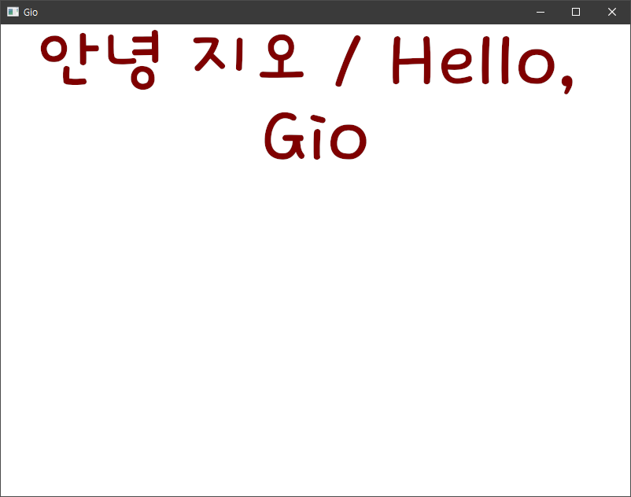

# [Gio](https://gioui.org/) practice



~~Copied [gio-example/hello](https://git.sr.ht/~eliasnaur/gio-example/tree/main/item/hello)~~
https://jonegil.github.io/gui-with-gio

Android practice : https://github.com/practice-golang/hello-fembed

## Run
```sh
$ go run ./main.go
```
or
```sh
# fonts directory must be placed to same path with hello-gio binary
$ go build -ldflags="-H windowsgui"
$ ./hello-gio
```


## Font
```go
....

once.Do(func() {
		// register(text.Font{}, goregular.TTF)

		ttfBytes, err := ioutil.ReadFile("./fonts/dongdong.ttf")

		if err != nil {
			log.Fatal(err)
		}
		register(text.Font{}, ttfBytes)

....
```

For CJK showing, Changed font from `gioui.org/font/gofont` to `giofont`
